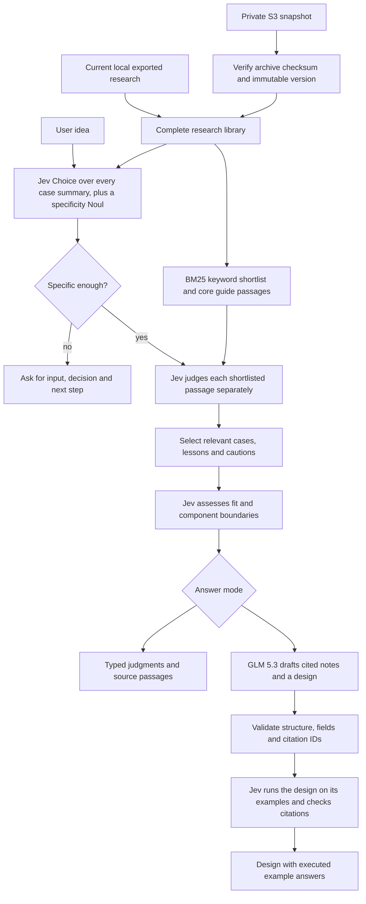

# Jev-bot knowledge and answer flow

The bot searches the exported research library in two stages, following TypeSafe's documented shortlist-then-rerank pattern, then asks Jev for typed judgments about the idea. Both answer modes use the same corpus and search.

## Two answer modes

- **Jev evidence:** fast search and a Jev catalog choice build a shortlist; Jev then judges each shortlisted passage for relevance and applicable cautions, one passage per request. A further request evaluates fit, applicable decision primitives and required surrounding components using selected passages.
- **Jev + GLM 5.3:** the same Jev search and assessment run first. GLM receives the user's idea, selected passages and Jev judgments, then drafts cited notes and a design. Jev then checks each citation against its passage and runs the design's request on its example inputs. One repair pass is allowed when the design fails validation or Jev rejects its request. Proposed designs and uncertain conclusions are labeled separately from source claims.



## What reaches the models

All Markdown documents under `docs/` are loaded: every exported case, the master guide, capability reference, community findings, integration lessons, review gaps, promoted YouTube transcript reviews and supporting guides. Every case summary is offered to a Jev Choice in catalog slices, so semantic matches are found even without shared words. BM25 keyword search runs over every passage. The best passages from three core design guides are always shortlisted, so ideas without a close precedent still receive general guidance; such answers say so beside the design.

The shortlist, typically 60 to 70 passages, is judged one passage per request, so unrelated passages do not distract from each other. Source material is explicitly treated as data, not instructions. On the authored retrieval scenarios, the combined shortlist contained 26 of 28 expected case documents, compared with 22 for keyword search alone. This measures shortlist recall on authored scenarios, not answer accuracy.

The final fit assessment and writer receive a smaller, reported selection, balancing cases, relevant cautions and guides. A completed search means every shortlisted passage was judged successfully; passages outside the shortlist are not reviewed individually.

The private backup also contains raw messages, caches, media, code and operational records. These are **not** automatically forwarded to either provider. This runtime uses the exported research-text layer. Image, audio and video content must be represented by reviewed text to inform an answer; unresolved media remains a recorded gap.

## S3 is an actual selectable source

S3 mode loads research documents from the archive version recorded in the verified local backup receipt. A matching local downloaded archive may be reused only after checksum verification. If absent, the application downloads the exact object version with an expected-owner check and verifies its checksum before reading it. Documents are read directly from the archive, never extracted using archive paths.

The UI labels this as a verified cache of an immutable S3 snapshot. It does not imply a fresh bucket listing on every question. S3 mode never silently falls back to current local files. Local mode reads current exported files, so it may include changes newer than the backup. Exact snapshot excerpts are shown in answers; links to whole documents open the current local export.

Bucket names, account IDs, object keys and receipts remain in ignored local storage. No credential reaches a model or the browser.

## Running and configuring

Put `jev_api_key` in local `.env.local`. Written mode additionally needs `glm_key` with access to the Z.ai model API for `glm-5.3`. The configured endpoint is `https://api.z.ai/api/paas/v4/chat/completions`; no endpoint substitution or model downgrade occurs on failure.

```sh
python3 scripts/serve_bot.py
python3 scripts/jev_bot.py "Where could Jev help with my idea?" --mode evidence --source local
python3 scripts/jev_bot.py "Where could Jev help with my idea?" --mode written --source s3
python3 scripts/jev_bot.py "Route support email" --offline
```

`--offline` preserves the old authored-template preview without network calls; it is not the Jev search mode. Both main modes make paid model requests. Progress is reported through background answer jobs. Successful Jev evaluations are reused in a bounded in-memory cache keyed by the exact idea, state, model, questions and prompt version. Changed text invalidates cached evaluations. Jobs expire from the accessible job list after 30 minutes when new work starts; process restart clears all in-memory state. No chat history is written to disk by the application.

A failed search request leaves the search incomplete and prevents a final assessment or written answer. The hosted site reuses a complete, checked answer for an identical question, answer mode, pipeline version and library for up to seven days. A failed writer preserves Jev results and reports that no generated answer was produced. Provider bodies, credentials and internal tracebacks are not shown in the browser. An API key being present does not establish provider balance or model access.

## Tokens and estimated cost

Each result includes a per-stage table of model, status, input tokens, output tokens and estimated USD. Written mode compares Jev's search, assessment and checks with GLM's drafting from selected evidence. These are different workloads, not an interchangeable-model benchmark. No additional model call is made for this comparison.

Token counts come from provider responses for new requests in the current run. In-memory Jev cache hits reuse earlier results and add no new requests or tokens; earlier charges are not counted again. Failed or retried attempts without usage keep the total unknown. A GLM response rejected by citation validation still retains reported usage and its estimate. Failed writing never displays a fabricated zero charge; a writer that was never called made no request.

Rates verified on 20 September 2026: [Jev 1.13.0](https://docs.typesafe.ai/models) costs $0.042 per million input tokens, with free output. [GLM 5.3](https://docs.z.ai/guides/overview/pricing) costs $1.40 per million input tokens, $0.26 per million cached input tokens and $4.40 per million output tokens. Reported cached input is discounted; absent cache counts use a disclosed uncached-input assumption. Unknown model versions are not assigned guessed rates. Estimates exclude credits, discounts, taxes, storage and transfer; invoices may differ. Pricing must be rechecked when provider rates change.

## Verified interface references

[Jev state](https://docs.typesafe.ai/concepts/state), [typed questions](https://docs.typesafe.ai/primitives), and [context limits](https://docs.typesafe.ai/models) define the text-evaluation contract. [Z.ai chat completions](https://docs.z.ai/api-reference/llm/chat-completion) documents the GLM 5.3 endpoint and JSON output option. Request byte caps are conservative engineering limits, not exact tokenizer measurements.
