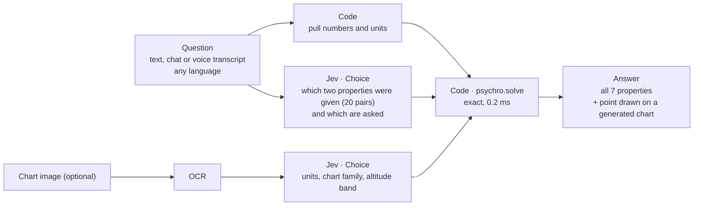

# Psychrometric charts: where Jev fits

Status: tested, 30 September 2026. Every test was pre-registered in [PLAN.md](PLAN.md) before any request was sent. Live demo: https://dm6rtlrn56ej8.cloudfront.net/psychro-data

## Results

| Test | Result | Pass line |
|---|---|---|
| Pilot 1: Jev asked 7 yes/no "is it asked?" questions | 159 / 200 ✗ | 194 |
| Pilot 2: return all 7 properties; units narrow the options | 194 / 200 ✓ | 194 |
| Replication on 600 fresh questions | 586 / 600 (97.7%) | reported |
| Confirm step for low-confidence readings (threshold 0.75) | caught 12 / 14 misreads ✗ | ≥ 90% |
| Reading uploaded charts, version 2 | 9 / 10 within ±0.3 °C ✓ | 9 |
| The chart's printed lines vs the equations | RH within 0.2%; the 0 °C wet-bulb line is off by 0.32 °C | ±1% RH, ±0.3 °C |

All misses were technician shorthand. A misread is either refused as impossible air or far off, never slightly off. When Jev reads the question right, the answer's error is zero. Raw logs are in `runs/`, and the scripts in `src/`. The sample chart used in the upload test (© FlyCarpet Inc) is not in this repository.

The sections below are the original exploration, written before the tests.

## The problem

HVAC engineers and technicians read psychrometric charts to get the state of moist air. The charts come in many variants: SI or IP units; sea level or altitude; normal, low or high temperature ranges; ASHRAE, CIBSE or Carrier layouts; and the European Mollier h-x diagram, which rotates the axes. A chart carries seven properties at once:

| Property | Symbol | Unit |
|---|---|---|
| Dry-bulb temperature | tdb | °C |
| Wet-bulb temperature | twb | °C |
| Dew-point temperature | tdp | °C |
| Relative humidity | rh | % |
| Humidity ratio | w | g/kg dry air |
| Enthalpy | h | kJ/kg dry air |
| Specific volume | v | m³/kg dry air |

Any two independent properties fix the other five, at a known air pressure. Reading them by eye is slow and loses precision. ASHRAE charts are drawn on oblique enthalpy and humidity-ratio coordinates, so dry-bulb lines are not quite vertical.

## Key finding: the chart is a drawing of equations

Every line on a psychrometric chart comes from the moist-air relations in ASHRAE Handbook Fundamentals, chapter 1. With the pressure and two properties, the other five are exact. No image reading is needed.

`src/psychro.py` implements those relations, the same ones PsychroLib uses:

- 960 round-trip checks pass: every usable pair of properties, 24 states, sea level and 1,500 m.
- It matches the ASHRAE saturation-pressure table and the textbook state. At 25 °C and 50% RH it gives wet-bulb 17.9 °C, dew point 13.9 °C, 50.3 kJ/kg and 0.858 m³/kg.
- One solve takes 0.04 ms when dry-bulb is given, or 0.2 ms when it isn't.
- Two pairs need care:
  - Dew point with humidity ratio is not a valid pair, because both carry the same information. The solver refuses it.
  - Wet-bulb with enthalpy is ill-conditioned, because the two lines are nearly parallel. Small input errors move the answer a lot.

**So for standard charts, don't read the chart. Compute the state, then draw the chart as the output.**

## Fit check against the research library

| Idea | What the library says (public `docs/`) | Verdict |
|---|---|---|
| Jev reads the chart image | "No images. Caption or OCR first" ([master guide](../../docs/jev-master-guide.md)). The input is "Text; string, JSON object or array; no native image/audio/video input" ([knowledge reference](../../docs/jev-knowledge-reference.md)). | ✗ Not possible |
| Jev works out the missing values | For exact arithmetic: "Deterministic code. Jev may select among validated candidates." "Counting and numeric comparison belong in code" ([master guide](../../docs/jev-master-guide.md)). A date-arithmetic error was recorded at 0.99 confidence ([community findings](../../docs/community-evidence-findings.md)). | ✗ Wrong tool |
| Jev understands the question: which two values were given and what's being asked, in any wording or language | Tool routing over names and descriptions helped ([master guide](../../docs/jev-master-guide.md)). The Bharat test scored 89.9% zero-shot on the 10 most-spoken Indian languages. | ✓ Strong fit |
| Jev identifies which chart a scan is (units, chart family, altitude) from OCR text | "Caption or OCR first; builders report Jev combines noisy OCR with other evidence well" (master guide). | ✓ Plausible |
| Jev judges the air process from technician notes ("coil sweating, room feels muggy") | Text judgment with fixed options | ~ Later |

## Proposed pipeline: Jev reads the question, code does the math

- **Time:** about 0.4 s for Jev plus 0.2 ms to solve. **Cost:** about $0.00003 per question at Jev's list price.
- **Where it isn't needed:** a form with two dropdowns needs no AI. Jev earns its place with free text: chat, WhatsApp, voice transcripts, service tickets, jargon ("WB 22, DB 30", "grains", "gr/lb") and Indian languages.
- **Out of scope for v1:** reading points or process lines drawn by hand on a manufacturer's chart. That needs vision and axis calibration.

## Proposed experiment (the pass lines are fixed before any request is sent)

Data only, with no manual collection.

**Questions:** 1,200 generated from exact states, so the answer to every question is known exactly.
- They cover the 20 usable property pairs, SI and IP units, and three phrasing styles: textbook, technician shorthand and chat.
- GLM 5.3 paraphrases and translates them into Hindi and Telugu. Code checks that the numbers survive unchanged.

**Arms**
- **A (the pipeline):** Jev reads the question and code computes the answer.
- **B:** gpt-6-astra answers the question directly, as in "just ask the AI".
- **C:** gpt-6-astra reads the question and code computes the answer.
- **D (optional):** a vision model reads a rendered chart image with a marked point.

**Pass lines**

| Line | Pilot: 200 English questions, arm A only | Full run |
|---|---|---|
| P1: Jev picks the right given pair | ≥ 97% | ≥ 97% English, ≥ 93% Hindi and Telugu |
| P2: final answer within tolerance (±0.2 °C, ±1% RH, ±0.2 g/kg, ±0.5 kJ/kg) | ≥ 97% | ≥ 97% |
| Comparison with arms B, C and D | none | Accuracy, cost and time reported as measured, with no pass line |

If the pilot misses P1 or P2, the idea is dropped with no post.

**Estimated spend:** pilot about $0.02. Full run about $0.10 for Jev, about $25–35 for gpt-6-astra (arms B and C), and about $2 for GLM paraphrasing.

## Post and article angle (only if the pilot passes)

- **Plain title:** *Psychrometric charts and AI: let the equations do the math and let Jev read the question*
- **Hook:** most people try to make an AI read the chart, but the chart is only a picture of equations.
- **Video:** a technician's question in Telugu → Jev picks "dry-bulb + wet-bulb" → the numbers go in → the point drops onto a chart drawn by code, next to the error from asking an LLM directly.
- **Demo:** a `/psychro-demo` page on the jev-bot site, built the same way as `/bharat-test-demo`.

## Files

- `src/psychro.py`: solver for moist-air states (SI; any altitude via `pressure_at`)
- `tests/test_psychro.py`: reference values and round-trip checks (`python3 -m unittest discover -s tests`)
